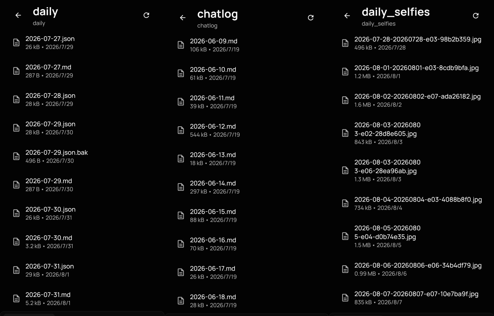

# xiaodou-system

<p align="center">
  
  
  
  
  <a href="README.md"></a>
  
</p>

## Abstract

**xiaodou-system** is a **persona-agnostic runtime framework** built on [OpenClaw](https://docs.openclaw.ai) for long-term companionship scenarios. The system splits a natural day into three independently inspectable stages: **daily planning (step02) → scheduling and proactive outreach (step03) → day-end memory consolidation (step04)**. Persona content is described by Markdown files in the workspace; scheduling, validation, state transitions, persistence, and failure recovery are handled by Linux scheduling primitives and Python scripts.

The project is not concerned with improving the reasoning ability of language models themselves, but with solving the operational problems of long-term companion agents: how a persona can maintain an executable schedule without immediate user input; how proactive messages can be incorporated into a trackable event state; how the previous day's important experiences can participate in the current interaction on the next day **without the user having to explicitly request retrieval**; and how to avoid session compaction, long-term memory distillation, and the session lifecycle each producing mutually inconsistent representations of history.

Three concepts need to be distinguished here: **memory being persisted (Persistence) does not mean it will be retrieved (Retrieval), and memory being retrievable does not mean the persona has continuity (Continuity)**. OpenClaw currently provides generic capabilities such as memory files, memory search, Active Memory, session transcripts, compaction, Dreaming, and Automations [4–10]; xiaodou-system does not re-implement this infrastructure, but rather adds, on top of it, a **natural-day lifecycle and single memory authority** for companion personas: the full session of the day serves as high-fidelity working memory, and cross-day memory is generated solely by the project's own step04; a controlled rollover then follows.

Existing research has separately demonstrated the feasibility of LLM-based agents for **memory, reflection, planning, and long-term cross-session interaction**: Generative Agents uses memory, reflection, and planning for sustained behavior simulation [1]; MemGPT supports long-horizon dialogue through hierarchical memory management [2]; and LD-Agent further studies event memory and dynamic persona modeling in long-term dialogue [3]. xiaodou-system does not attempt to replace this model-level research; rather, it provides a deployable engineering implementation that organizes persona configuration, schedule generation, system-level scheduling, proactive messages, full session evidence, and day-end memory into a fixed pipeline.

The current implementation uses **Linux + OpenClaw + Telegram** as its validation environment, with DeepSeek by default as the text model and Seedream as the image generation service. External services are encapsulated uniformly through `providers/`; runtime data is persisted via JSON Schema, YAML configuration, event logs, and Markdown memory files. Language and image models remain generative components, so the term "deterministic" in this document refers only to **the determinism of control flow, data contracts, and state management**, not to run-to-run consistency of model text or image outputs. The current conclusions come from end-to-end validation in a single deployment environment and do not represent cross-platform performance, model quality, or production-grade SLA.

## I. Problem Definition and Design Scope

### 1.1 The Engineering Problem of Long-Term Companion Agents

Large language models can produce coherent multi-turn dialogue, but "being able to converse" and "being able to run over the long term" are not the same problem. Long-term agents usually also need to explicitly handle time, cross-session memory, behavioral plans, and external state. Relevant research has shown that memory retrieval, reflection, and planning directly affect the behavioral continuity of long-term agents [1][2]; work on long-term dialogue also models event memory and persona management as separate modules [3].

xiaodou-system scopes the problem to five engineering goals:

1. **Temporal Proactivity**  
   Without an immediate user message, the system can still generate future events from the day's plan and decide at a scheduled time whether to reach out.

2. **Cross-day Continuity**  
   Yesterday's important events should not merely "exist in some searchable file or transcript"; they should directly influence the Planner, event judgment, and interpretation of current short utterances on the next natural day. For companion-style interaction, `Persistence ≠ Retrieval ≠ Continuity`.

3. **Single Memory Authority**  
   The same history should not be generated by multiple uncoordinated summarization systems and then participate in reasoning over the long term. The day's full session serves as raw working memory; cross-day consolidated memory is generated solely by xiaodou-system's day-end pipeline.

4. **Operational Determinism**  
   Scheduling, validation, idempotency, locking, state write-back, and archiving should be controlled by deterministic programs. The generative model is responsible for generating content, not for deciding whether key files are written or whether the same event executes twice.

5. **Role Portability**  
   Personality, identity, life routines, and user relationships should be represented as much as possible as workspace files rather than hardcoded into Python scripts. When changing personas, in principle only the persona contract and resource configuration need to be replaced.

### 1.2 Relationship to OpenClaw

OpenClaw already provides a complete agent runtime foundation, including workspace, Gateway-owned sessions, persistent memory, memory search, Active Memory, message channels such as Telegram, and a built-in Automations scheduler [4–10]. Therefore, xiaodou-system is **not a re-implementation of OpenClaw**.

What this project adds is a set of runtime protocols specific to "daily life trajectory + proactive outreach + day-end memory":

- organizing a natural day into fixed step02 / step03 / step04 stages;
- using `daily/YYYY-MM-DD.json` as the explicit data object for the day's plan and execution state;
- structurally validating generation results with JSON Schema;
- using Linux `cron` and `at` as the external scheduling layer of the current implementation;
- managing duplicate execution and concurrency with idempotency gates, `flock`, transactional write-back, and event logs;
- treating the current natural day's session as high-fidelity working memory;
- using the project's custom step04 as the **single cross-day memory compilation path**;
- performing a controlled session rollover only after the day-end memory has completed its main persistence steps.

OpenClaw's current detailed daily notes are read on demand in ordinary turns mainly through `memory_search` / `memory_get` [6]; Active Memory can proactively recall long-term information in the interaction path, but the default `escalate` mode still relies primarily on a strong triggered hit or "the current message expresses recall intent" as its launch condition [7]. This is a reasonable cost-and-latency trade-off for general agents, but it cannot guarantee that short utterances in companionship scenarios — such as "I've arrived," "I'm out now," "it's over" — which rely heavily on yesterday's context yet lack explicit retrieval cues, will always obtain the needed history.

OpenClaw's default AGENTS template currently requires reading today's and yesterday's daily notes along with `MEMORY.md` at the start of a new session [8], and `/new` / `/reset` can also re-supply recent daily memory in the first turn of a new session [9]. These mechanisms improve recovery across session boundaries, but they still depend on the relevant content **having already been correctly written into daily memory**, and they do not replace application-level control over "when, by whom, and under what rules the day's full conversation is compiled into cross-day state."

### 1.3 Non-Goals

The current version does not address the following:

- It does not claim that the persona possesses consciousness or a real life in the human sense;
- It does not guarantee deterministic LLM / image model outputs;
- It does not provide cross-platform compatibility guarantees;
- It does not use chat-quality benchmarks, emotional companionship effects, or user studies as current conclusions;
- It does not equate this project's 7-file persona contract with OpenClaw's default workspace conventions;
- It does not deny the general value of OpenClaw's native memory / compaction / Active Memory; the project only explains that they target different goals from the memory-consumption strategy of a companion persona.

## II. System Design

### 2.1 Separating the Persona Contract from the Runtime Framework

xiaodou-system centralizes persona definition in 7 core Markdown files in the workspace:

| File | Responsibility in xiaodou-system |
|---|---|
| `AGENTS.md` | Operating rules and persona-side behavioral constraints |
| `IDENTITY.md` | Identity and stable background information |
| `SOUL.md` | Personality, expression style, emotions, and interaction boundaries |
| `LIFE.md` | Life routines and the basis for the Planner's schedule generation |
| `USER.md` | The companion target and related long-term information |
| `TOOLS.md` | Tools and runtime environment description |
| `MEMORY.md` | Consolidated long-term memory |

These 7 files constitute xiaodou-system's **persona contract**. Some of them also belong to OpenClaw's workspace / memory system; content such as `LIFE.md` is read by the project's own Planner and scripts. The set of workspace bootstrap files currently injected by default per the OpenClaw official documentation is not identical to this project's "7-file contract" [4], so the two should not be conflated.

System code does not in principle branch on a specific persona's name, experiences, or expression style. Persona differences enter the generation stage, while scheduling and persistence logic remain consistent.

### 2.2 Separating the Control Plane from the Generation Plane

The system divides runtime responsibilities into two categories:

- **Generation plane**: DeepSeek is responsible for plan, text, and memory-related generation; Seedream is responsible for optional selfie image generation.
- **Control plane**: Python scripts, JSON Schema, `cron`, `at`, `flock`, event logs, and transaction state decide when to execute, whether input is valid, whether an event has already been executed, and how results are persisted.

The purpose of this division is not to eliminate uncertainty from generative models, but to move control logic that should not be decided by the model out of the model context.

### 2.3 External Dependency Abstraction

All external services are encapsulated through `providers/`. The current implementation includes:

- `providers/llm/deepseek_urllib.py`
- `providers/llm/openai_compatible.py`
- `providers/image/seedream.py`
- `providers/openclaw_gateway.py`
- `providers/gateway_history.py`
- `providers/gateway_sessions.py`
- `providers/telegram.py`
- `providers/base.py`

Business scripts depend only on provider interfaces and do not scatter third-party API details throughout the core flow. This design reduces the blast radius when replacing models, message channels, or the Gateway integration.

### 2.4 Memory Consumption Contract and Single Memory Authority

xiaodou-system does not treat "the file has been written to disk" as a sufficient condition for memory continuity. The system distinguishes three states:

```text
Persistence  Whether the memory still exists
Retrieval    Whether the current run can find it
Continuity   Whether the persona uses it naturally without user prompting
```

For general agents, on-demand retrieval is usually sufficient; for companion personas, recent experiences usually need to enter the interpretive context before the user's current question. For example, the user said yesterday, "I have an exam tomorrow afternoon," and today only sends "I'm heading out." The current message itself does not constitute a strong retrieval query, but its reasonable interpretation depends heavily on yesterday's state.

Therefore, this project adopts a two-layer memory responsibility:

```text
Working Memory
= the full OpenClaw session of the current natural day
= retains the day's raw conversations and proactive messages

Consolidated Memory
= daily memory + MEMORY.md
= generated solely by xiaodou-system step04 from the day's evidence
```

More distant information that has not entered the recent working set can still be retrieved on demand through mechanisms such as OpenClaw memory search; but **yesterday's important state should not depend on the user explicitly saying "go look up yesterday" to enter current reasoning**.

This design also prescribes the authoritative path for history representation:

```text
Full session
    + DailyPlan
    + Event Journal
    + Proactive message records
            ↓
      xiaodou step04
            ↓
   DailyMemory / MEMORY.md
            ↓
        Next natural day
```

The project does not want the same cross-day history to have both an OpenClaw compaction summary and a xiaodou-system Memory Compiler as two long-term semantic sources. Even if both summaries are "basically correct," they can still differ in event details, uncompleted items, timing, relationship state, or information priority, thereby forming dual memory authority.

---

## III. System Architecture

### 3.1 Overall Architecture

<p align="center">
  
  <br/>
  <em>Fig. 1: Overall system architecture — three business pipelines with a persistent layer running throughout</em>
</p>

The system consists of three business pipelines serialized in time. `providers/` sits at the external service boundary; the workspace, daily, chatlog, memory, event logs, and configuration files constitute persistent state; Linux scheduling primitives trigger the deterministic scripts.

### 3.2 step02: Daily Planning

**Trigger time: 06:00**

Primary scripts:

- `build_daily_plan.py`
- `validate_daily_plan.py`
- `initialize_daily_file.py`
- `schema_engine.py`
- `schema_validator.py`
- `weather_provider.py`

Primary inputs include:

- the 7 persona core files;
- the day's weather;
- the last 7 days of memory;
- yesterday's execution results.

Output:

```text
daily/YYYY-MM-DD.json
```

This file describes the day's activities, locations, emotional states, and outreach windows. Model-generated output must pass the corresponding JSON Schema before proceeding to the next stage; validation failures are retried per the established policy. This guarantees **structural contract validity**, not that two model calls produce the same plan.

### 3.3 step03: Scheduling and Event Execution

**Morning scheduling trigger: 06:20**

Primary scripts:

- `run_morning_pipeline_step03.py`
- `schedule_step03_events.py`
- `at_adapter.py`
- `execute_daily_event.py`
- `event_decision.py`
- `message_generation.py`
- `event_transaction.py`
- `deterministic_gate.py`
- `context_snapshot.py`
- `event_journal.py`

Execution proceeds in two stages:

1. A morning script reads the day's plan and submits the non-silent events that need to be executed via `at_adapter.py` to the system `at`;
2. When the target time arrives, `execute_daily_event.py` executes the event transaction for a single event.

The typical chain for a single event:

```text
Read the plan and context
    ↓
Idempotency check / acquire lock
    ↓
Evaluate whether the current event should still be sent
    ↓
Generate message text
    ↓
Optional: call Seedream to generate an image
    ↓
Send via Telegram
    ↓
Write into the OpenClaw session context
    ↓
Transaction state and event log write-back
```

Key constraints include:

- stable event identity;
- idempotency against duplication;
- `flock` mutual exclusion;
- write-back of send results and failure states;
- event-level logging;
- separate recording of "generated," "sent," and "injected" states.

### 3.4 step04: Day-End Memory and the Session Commit Boundary

step04 consolidates the raw evidence of the end of a natural day into long-term state that the next natural day can consume directly. The current default schedule is:

```text
00:20 / 00:50  finalize
02:00          incremental
02:03          attach
04:00          session_rollover
Sun 04:30      weekly compress
```

Primary scripts:

- `finalize_yesterday.py`
- `build_daily_memory.py`
- `update_memory_md.py`
- `session_rollover.py`
- `render_chatlog.py`
- `normalize_chatlog.py`
- `memory_quality.py`
- `rollover_artifacts.py`

The day-end input includes not only chat text but:

- the full session of the current natural day;
- the plan and execution state in `daily/YYYY-MM-DD.json`;
- the step03 event journal / transaction state;
- the proactive messages actually sent;
- subsequent user replies;
- associable artifacts such as that day's images.

Its responsibilities, in order, cover:

1. summarizing the previous day's conversations and events to generate daily memory;
2. incrementally consolidating new information into long-term memory;
3. writing qualifying results into `MEMORY.md`;
4. performing session rollover after the aforementioned cross-day memory processing;
5. periodically compressing the long-term memory body to keep it within the project's capacity limits.

Here `session_rollover` should not be understood as an ordinary "cleanup of history" operation. It bears the **Memory Commit Boundary**: the current session is treated as high-fidelity working memory within a natural day; only after the day-end pipeline has completed its main memory persistence steps does a new session begin. The goal is to make "the day's full session → xiaodou-system Memory Compiler" the single formal conversion path for cross-day history.

OpenClaw currently no longer auto-resets daily by default; daily / idle reset are optional policies [9][10]. xiaodou-system nevertheless retains a daily rollover as an active application-layer choice: rather than letting a session grow indefinitely and eventually continuing on a compaction summary, the project prefers to retain the full session within a single day and then perform its own memory consolidation at a clear day boundary.

OpenClaw compaction summarizes earlier history into a persistent `compaction` entry; later turns run on that summary plus recent uncompressed messages [10][11]. Before compaction, OpenClaw can also run an automatic memory flush that writes context the model judges important into memory files [5]. These mechanisms suit general long sessions, but if enabled alongside xiaodou-system's own daily memory compiler, they can form two mutually independent history summaries. The project therefore treats **avoiding cross-day dual summary authority** as an important constraint in session lifecycle design.

### 3.5 Persistence and Audit

Primary persistence targets include:

```text
workspace/
MEMORY.md
daily/
daily/YYYY-MM-DD.json
daily memory
chatlog/
settings.yaml
event journal / transaction state
backups / rollover artifacts
```

The system design requires key state to be recorded as files or structured data where possible, rather than existing only in the current model context. This allows re-evaluating runtime state after a process exit, session rollover, or a single model-call failure.

---

## IV. Determinism Boundary and Fault Handling

### 4.1 Data Contracts

The project uses JSON Schema to constrain cross-stage data. There are currently 19 schemas that restrict the structure of plans, events, and related intermediate artifacts.

Schema validation handles:

- missing required fields;
- type errors;
- out-of-range enum values;
- model outputs that do not conform to the protocol.

Schemas do not judge whether text content is "true" or "natural."

### 4.2 Idempotency and Concurrency

step03 adds stable identity, state checks, and `flock` to event execution. Its goal is to avoid the same logical event being sent more than once on cron re-entry, duplicate `at` triggers, or manual reruns.

### 4.3 Transaction State

Sending a message is an external side effect, so event execution cannot simply be represented by "did the script exit 0." The system records the generate, send, inject, and write-back steps separately, so that after a failure it can identify which side effects have already occurred and decide the retry boundary accordingly.

### 4.4 Backup, Recovery, and Rollover

The project provides:

- `backup_openclaw.py`
- `raw_backup.py`
- `rollover_artifacts.py`

Backups cover runtime configuration, long-term memory, conversation records, and related event artifacts. The existence of backups and underlying transcripts solves **physical persistence and disaster recovery**; it is not equivalent to the persona being able to naturally use that information in the current turn.

Therefore, the project does not adopt the criterion that "as long as the data can still be found in the old transcript / JSONL / SQLite, the persona has not forgotten." For companion interaction, if history must await the user explicitly reminding the system to "go look up yesterday's records" in order to re-enter reasoning, a product-level continuity failure has already occurred.

The responsibility of `session_rollover.py` is therefore not merely to create a new session, but to place the session lifecycle after the day-end memory pipeline. The project requires that deployments maintain the order **memory processing precedes rollover**, and as far as possible avoid compaction preceding step04's rewrite of history representation within a single-day session.

---

## V. OpenClaw Integration Boundary: Why Native Mechanisms Are Not Directly Used

### 5.1 Capabilities OpenClaw Already Provides

Per the current official documentation, OpenClaw already provides the following infrastructure directly relevant to this project:

- **Agent workspace**: gives each agent an isolated workspace and context files [4];
- **Persistent memory**: `MEMORY.md`, daily memory, memory search, memory-core, and Dreaming [5][6][12];
- **Active Memory**: performs active recall in qualifying interaction sessions [7];
- **Gateway-owned sessions**: session state, reset, and transcripts are managed by the Gateway [9][10];
- **Compaction**: compresses earlier history into a persistent summary when context approaches the model limit, and continues the current session [10][11];
- **Message channels**: channels such as Telegram;
- **Automations**: persistent one-shot and recurring tasks.

Therefore, xiaodou-system's main contribution is not re-implementing sessions, memory search, a scheduler, or Telegram, but defining how these generic primitives jointly serve the **natural-day lifecycle of a companion persona**.

### 5.2 Why "Already Saved" Still Is Not Companion-Style Memory

OpenClaw currently places detailed daily notes in `memory/*.md` and explicitly states that these files are not part of the default Project Context in ordinary turns; ordinary turns mainly read them on demand via `memory_search` / `memory_get` [6]. Active Memory can improve this, but the deep recall in the default `escalate` mode primarily runs when the current message expresses recall intent and there is no strong deterministic hit [7].

The problem this project observed in actual long-term use is that cross-day information, even when written into daily memory, does not necessarily enter the model first during the next natural conversation. If the user explicitly asks "what did we do yesterday," the system can more easily trigger memory search; but a large number of real messages in companionship scenarios do not take this form.

For example:

```text
Yesterday:
"I have an exam tomorrow afternoon."

Today:
"I'm heading out now."
```

The second sentence has no strong retrieval keywords, yet the persona is expected to naturally understand the relationship between "heading out" and yesterday's exam arrangement. For this kind of interaction, on-demand search is a remediation path, not a sufficient continuity mechanism.

OpenClaw's default AGENTS template already requires reading today's and yesterday's daily notes plus `MEMORY.md` at session start [8]; `/new` / `/reset` also preserve the tail of an ending session and re-supply recent notes in the first turn of the new session [9]. These behaviors are worth reusing, but they cannot guarantee:

1. that all important relationship state before the session switch has been correctly written into daily memory;
2. that ordinary turns during long running always have yesterday's key state;
3. that short utterances without explicit recall intent always trigger the needed history;
4. that the current day's plan, proactive events, and chat history are understood as one unified episode.

Therefore, xiaodou-system elevates recent cross-day state from "material searchable on demand" to **direct input for the next natural day's Planner and interaction context**; memory search mainly serves supplementary recall of more distant history.

### 5.3 Why OpenClaw Compaction Is Not Allowed to Become a Second History Summary

OpenClaw compaction summarizes earlier dialogue into a persistent `compaction` entry and retains recent messages; subsequent turns run on "compaction summary + uncompressed tail" [10][11]. Before compaction, OpenClaw can also run an automatic memory flush that writes important context into memory files [5].

For general long sessions this is a reasonable context-control mechanism.

But xiaodou-system already has its own:

```text
Full session
+ DailyPlan
+ Event Journal
+ Proactive messages
+ User interactions
        ↓
step04 Memory Compiler
        ↓
DailyMemory / MEMORY.md
```

If the same history is first summarized by OpenClaw compaction, the system may simultaneously contain:

```text
OpenClaw Compaction Summary
            +
xiaodou DailyMemory / MEMORY.md
```

The two summaries can both be basically correct yet not fully consistent. They may differ in choices around timing, event causality, relationship state, uncompleted items, or information priority. For a companion persona, the risk of "multiple history interpretations simultaneously participating in the current persona state" outweighs the benefit of saving some context tokens.

Hence, this project adopts the **single memory authority** principle:

> The current session retains the day's high-fidelity raw working memory; cross-day semantics are formally generated only by xiaodou-system's step04.

This does not mean OpenClaw compaction is forever forbidden. It means: **compaction should not become the cross-day canonical memory path of this project**. If the sheer volume of a single-day conversation is itself enough to hit the model context ceiling, then a larger context budget, an earlier controlled boundary, or dedicated adaptation is needed; the current version does not unconditionally guarantee that "compaction will never occur within a day."

### 5.4 Why a Daily Session Rollover Is Retained

The OpenClaw main session currently has no automatic reset by default; daily / idle reset are optional [9][10]. Therefore, xiaodou-system's 04:00 rollover is not following OpenClaw default behavior, but is an actively set **natural-day boundary**.

Its purpose is twofold:

1. **Protect single memory authority**  
   Before a session grows long enough to require compaction, hand the day's full session to step04 for unified consolidation.

2. **Keep the working-memory boundary clear**  
   A new session mainly carries the raw interactions of the new natural day; cross-day state from past dates is provided by `DailyMemory / MEMORY.md`, not implicitly by a session history that is growing longer and has been summarized multiple times.

Therefore:

```text
Day N Full Session
        ↓
step04 finalize / incremental / attach
        ↓
Cross-day memory completes its main persistence
        ↓
session rollover
        ↓
Day N+1
```

Here rollover is a **Memory Commit Boundary**, not "forgetting yesterday."

Historical transcripts / JSONL / SQLite still have backup, audit, and exception-recovery value, but they are not the primary memory interface for the persona's day-to-day reasoning. For this project, **being able to recover history from disk ≠ the persona maintaining continuity at the product level**.

### 5.5 Why the Current Version Still Uses `cron + at`

OpenClaw's Automations can already perform persistent scheduled tasks. xiaodou-system currently still uses Linux `cron` and `at`, mainly for the following implementation constraints:

- step02, step03, and step04 need to correspond directly to Linux file state and independent Python processes;
- each stage needs to leave inputs, outputs, and exit states that can be inspected individually;
- step03's future events naturally fit one-shot `at` jobs;
- the current validation environment already has a complete ops chain built around `flock + cron + atd`;
- even if system scheduling temporarily loses contact with the OpenClaw Gateway, it can still leave behind whether an event should have occurred, the failure reason, and a state awaiting recovery.

This approach should therefore be understood as the orchestration backend of the current version, not a denial of OpenClaw's scheduler capability. Future versions can add an OpenClaw Automations adapter while keeping the DailyPlan, Event Model, and step04 data contracts unchanged.

### 5.6 Why an Independent step04 Is Retained

OpenClaw's current memory system already has Markdown memory, memory search, automatic memory flush, Active Memory, Dreaming, and consolidation [5–8][12]. xiaodou-system retains an independent step04 not because OpenClaw "has no memory system," but because the two optimize for different goals.

OpenClaw mainly solves:

- how information is persisted;
- how it is indexed and recalled on demand;
- how long sessions are compacted;
- which short-term signals are worth promoting to durable memory.

xiaodou-system additionally requires:

- that yesterday's plan, actual events, proactive messages, and chats form a unified episode;
- that yesterday's key state participates directly in the next day rather than waiting for semantic recall;
- that there is only one canonical compilation path from the current session to cross-day memory;
- that session rollover sits after that path;
- that the user can inspect what was retained, merged, and compressed each day.

Therefore, step04 is closer to an **episodic day compiler** than another generic memory-search engine.

## VI. Runtime Evidence

This section only shows actual runtime results from the current Linux validation environment, to illustrate that the message chain and file persistence are wired through. The following screenshots do not constitute chat-quality evaluation, user studies, or cross-environment performance proof.

### 6.1 Telegram Message Chain

<p align="center">
  
  <br/>
  <em>Fig. 2-a: Day-to-day Telegram conversations and selfies by the persona</em>
</p>

The current implementation can trigger proactive events from the daily plan and, when event policy allows, generate text and optional images, then send them via Telegram.

### 6.2 File Persistence

<p align="center">
  
  <br/>
  <em>Fig. 2-b: The auto-persisted daily / chatlog / daily_selfies data directories</em>
</p>

During operation, `daily/`, `chatlog/`, `daily_selfies/`, and `MEMORY.md` respectively store plan/execution data, conversation records, image artifacts, and long-term memory. Together they form the main input for both fault diagnosis and day-end consolidation.

---

## VII. Deployment

### 7.1 Environment Requirements

The current validation target is **Linux**:

- Python 3.10+
- `at` / `atd`
- `cron`
- `flock`
- default timezone: `Asia/Shanghai`
- [OpenClaw](https://docs.openclaw.ai) installed and initialized
- Python dependencies:

```bash
pip install -r requirements.txt
```

The OpenClaw CLI still provides `openclaw configure`, `openclaw health`, and other commands; the Gateway default port is `18789`, but it can be changed via configuration [10][11].

### 7.2 Configuring OpenClaw

```bash
openclaw configure
openclaw health
```

At minimum you need to complete:

- a usable model/provider configuration;
- Gateway startup and health checks;
- Telegram channel configuration;
- the workspace / session correspondence used by this instance.

If the current host already has a Gateway occupying the default port, configure another port for the instance, for example:

```bash
openclaw config set gateway.port 19203
```

Afterward, start or restart the Gateway per the running style of the installed OpenClaw version.

### 7.3 Initializing xiaodou-system

```bash
git clone https://github.com/SHIJINS66/xiaodou-system.git
cd xiaodou-system
bash init.sh
```

`init.sh` is responsible for:

1. checking the runtime environment;
2. preparing the persona core-file templates;
3. generating `settings.yaml`;
4. creating runtime directories;
5. validating scripts and configuration;
6. optionally installing cron.

The default instance directory is:

```text
~/.openclaw/workspace
```

Another directory can be specified with `--instance-dir`.

For existing core files, the initializer should keep the original files unoverwritten; it only creates templates or skeletons for missing items.

### 7.4 Running the Setup Wizard

```bash
python3 scripts/guided_setup.py
```

The wizard processes, in order:

1. Python / atd / OpenClaw / timezone checks;
2. persona core-file checks;
3. API key configuration;
4. Telegram token and chat id binding;
5. OpenClaw Gateway session binding;
6. xiaodou-system memory write-contract configuration;
7. final validation;
8. Gateway configuration activation.

Available modes:

```text
--non-interactive    scripted configuration with defaults
--verify-only        run only the final validation
```

### 7.5 Installing Scheduled Tasks

```bash
bash init.sh --instance-dir ./instance --install-cron
```

When `ALLOW_CRON_APPLY=1`:

- root user writes to `/etc/crontab`;
- non-root user writes to the user-level crontab.

Default schedule:

```text
06:00           step02-morning
06:20           step03-morning
00:20 / 00:50   finalize
02:00           incremental
02:03           attach
04:00           session_rollover
Sun 04:30      weekly compress
```

step03 depends on the system `atd` service. After installation, confirm:

```bash
systemctl status atd
openclaw health
```

### 7.6 Configuration Files

Runtime configuration is centralized in:

```text
settings.yaml
```

Primary configuration domains include:

```text
system
runtime
character
companion
interaction_policy
selfie
models
delivery
```

Persona content should still be placed primarily in the 7 Markdown files rather than in Python logic.

---

## VIII. Directory Structure

```text
├── init.sh
├── AGENTS.md
├── IDENTITY.md
├── SOUL.md
├── LIFE.md
├── USER.md
├── TOOLS.md
├── MEMORY.md
├── scripts/                   # planner / validate / execute / memory
├── providers/                 # LLM / image / gateway / delivery
├── prompts/                   # per-stage model prompts
├── schemas/                   # JSON Schema
├── cron/                      # step02 / step03 / step04 scheduling templates
├── docs/                      # architecture diagram and runtime screenshots
└── settings.example.yaml
```

A running instance also produces `daily/`, `chatlog/`, selfie artifacts, event logs, and backup files; these are runtime data and should not be conflated with the source directory's responsibilities.

---

## IX. Current Limitations

### 9.1 Validation Scope

The current version has only been validated end-to-end on Linux. The "runnable" conclusion in this README refers only to the full chain having executed successfully in that validation environment.

Not yet established:

- a multi-machine / multi-distribution compatibility matrix;
- Windows / macOS scheduling adaptation;
- long-cycle failure-rate and SLA statistics;
- a manual or automated evaluation benchmark for proactive-message quality;
- systematic migration tests across different personas.

### 9.2 Platform

The current implementation depends on:

```text
cron
at / atd
flock
```

Therefore Windows and macOS cannot directly reuse the same scheduling implementation. If cross-platform support is extended in the future, the data contracts of step02 / step03 / step04 should be kept unchanged, and only the scheduler / lock adapter should be replaced.

### 9.3 Message Channels

The currently validated channel is Telegram. `providers/` has separated delivery from core business logic, but other channels must be separately implemented and tested for sending, media, identity binding, and session mapping.

### 9.4 Single-Day Session Context Budget

This project aims to keep the full, uncompacted session within a natural day as far as possible, then let step04 perform cross-day memory consolidation. But the model context window still has a hard ceiling; if the volume of messages, tool outputs, or proactive events within a day is unusually high, OpenClaw may still trigger compaction before rollover.

Therefore, the current implementation needs to monitor the single-day context budget. For very high-interaction-volume scenarios, future versions need to add controlled day-internal checkpoints or a dedicated context adapter, rather than simply assuming "a daily rollover is enough to avoid compaction forever."

### 9.5 Models and External Services

DeepSeek and Seedream are both external dependencies. API versions, model names, pricing, rate limits, and service availability may change, so production deployments should manage them via provider configuration rather than relying on the fixed service status stated in this README.

---

## X. Conclusion

xiaodou-system decomposes the operational problem of long-term companion agents into an explicit natural-day control loop:

```text
Persona and cross-day state
    ↓
step02: generate and validate the day's plan
    ↓
step03: schedule and execute proactive events
    ↓
Full Day Session + Event Evidence
    ↓
step04: compile DailyMemory / update MEMORY
    ↓
Controlled Session Rollover
    ↓
Next natural day
```

The core of the framework is neither a new language-model algorithm nor a re-implementation of OpenClaw, but a combination of four engineering constraints:

1. **Separation of persona content from runtime code**;
2. **Separation of the generative model from the deterministic control plane**;
3. **Modeling Persistence, Retrieval, and Continuity as separate concerns**;
4. **Keeping a single canonical conversion path between the day's full session and cross-day consolidated memory**.

OpenClaw solves general-agent runtime, session, memory, search, compaction, and scheduling problems; xiaodou-system goes further and defines "how a companion persona lives through a day continuously and hands that day unambiguously to the next."

In the current Linux + OpenClaw + Telegram validation environment, the above pipeline has formed a complete closed loop. Follow-up work should focus on expanding platform and message-channel coverage, establishing quantifiable stability tests, monitoring the single-day context budget, and verifying that persona migration can be done without modifying the core scheduling and memory protocols.

## References

1. Park, J. S., O'Brien, J. C., Cai, C. J., Morris, M. R., Liang, P., & Bernstein, M. S. **Generative Agents: Interactive Simulacra of Human Behavior**. arXiv:2304.03442, 2023.  
   https://arxiv.org/abs/2304.03442

2. Packer, C., Wooders, S., Lin, K., Fang, V., Patil, S. G., Stoica, I., & Gonzalez, J. E. **MemGPT: Towards LLMs as Operating Systems**. arXiv:2310.08560, 2023.  
   https://arxiv.org/abs/2310.08560

3. Li, H., Yang, C., Zhang, A., Deng, Y., Wang, X., & Chua, T.-S. **Hello Again! LLM-powered Personalized Agent for Long-term Dialogue**. arXiv:2406.05925, 2024.  
   https://arxiv.org/abs/2406.05925

4. OpenClaw Documentation. **Agent workspace / Context**.  
   https://docs.openclaw.ai/concepts/agent-workspace  
   https://docs.openclaw.ai/concepts/context

5. OpenClaw Documentation. **Memory overview**.  
   https://docs.openclaw.ai/concepts/memory

6. OpenClaw Documentation. **System prompt / memory bootstrap behavior**.  
   https://docs.openclaw.ai/concepts/system-prompt

7. OpenClaw Documentation. **Active Memory**.  
   https://docs.openclaw.ai/concepts/active-memory

8. OpenClaw Documentation. **Default AGENTS.md**.  
   https://docs.openclaw.ai/reference/AGENTS.default

9. OpenClaw Documentation. **The main session**.  
   https://docs.openclaw.ai/concepts/main-session

10. OpenClaw Documentation. **Session management**.  
    https://docs.openclaw.ai/concepts/session

11. OpenClaw Documentation. **Session management & compaction deep dive**.  
    https://docs.openclaw.ai/reference/session-management-compaction

12. OpenClaw Documentation. **Dreaming**.  
    https://docs.openclaw.ai/concepts/dreaming

13. OpenClaw Documentation. **Automations**.  
    https://docs.openclaw.ai/automation/cron-jobs

14. OpenClaw Documentation. **Telegram channel**.  
    https://docs.openclaw.ai/channels/telegram

15. OpenClaw Documentation. **Configure / CLI**.  
    https://docs.openclaw.ai/cli/configure

16. OpenClaw Documentation. **Gateway health**.  
    https://docs.openclaw.ai/gateway/health

> External technical descriptions and OpenClaw capability boundaries were verified against official documentation on **2026-08-16**. OpenClaw may adjust default session, memory, compaction, bootstrap, or scheduling mechanisms in later versions; at deployment, follow the official documentation of the installed version.

## License

MIT © xiaodou-system
