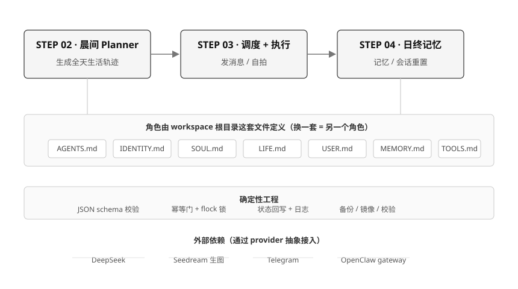

# xiaodou-system

<p align="center">
  
  
  
  <a href="README.en.md"></a>
</p>

## 摘要

本文提出并实现一套**角色无关**的「陪伴式智能体」运行框架 —— **xiaodou-system**。它将「自动生成生活轨迹、在适时主动触达用户、日终沉淀长期记忆」三项能力组织为一条确定性的每日流水线，使一个以文本与图像对话为主要交互形式的智能体，能够在无人值守的条件下长期、稳定、自主地运行。

本框架的设计蕴含一个核心理念：**角色与系统解耦**。角色并非被编码于脚本之中，而是由用户在 workspace 内定义的一组核心文件驱动；系统仅负责调度、执行与记忆等确定性运维。因此，更换一组角色文件即可得到行为与气质完全不同的陪伴对象，框架可被自由复用与二次开发。

在实现层面，本框架运行于 [OpenClaw](https://docs.openclaw.ai) 之上，对外部模型服务（DeepSeek、Seedream）的调用、消息发送与网关交互通过 `providers/` 抽象层解耦；其余步骤均由确定性脚本完成，并通过 JSON Schema 校验、幂等门、文件锁与状态回写等手段，保证全程可复现、可恢复、可审计。框架剥离自一个已长期在线运行的同名陪伴系统，保留其完整功能并去除角色与平台绑定，作为通用基础设施开放。

---

## 一、研究背景与立项动机

### 1.1 背景

大型语言模型的进展赋予了自动对话系统以自然、连贯的人格化表达能力。然而，将这类能力从「一次响应式的对话」推进为「一个可持续陪伴的长期存在」，仍然存在一道显著的鸿沟：一个真正的陪伴式智能体，不应只在用户主动发起时作出回应，而应当在无人提示的情况下，自主地生活、思考、记忆，并在恰当的时刻走向用户。

这类系统的形态在行业中以「AI 陪伴」「虚拟角色」等名义被反复探索，但多数停留于演示层面：它们或依赖预设的对话脚本，缺乏真正的自主生活能力；或完全依赖模型每次的偶发输出，行为不可预期、不可恢复；或与特定角色深度融合，难以被二次使用。

### 1.2 三个基本问题

将「陪伴式智能体」从演示推向可长期、稳定、自动运行的服务，本文将其归纳为三个相互独立又彼此关联的基本问题：

- **主动性问题（Proactivity）** —— 系统如何在没有用户触发的情况下，自主决定「是否沟通、何时沟通、以何种方式沟通」，并合理地感知用户的忙闲状态以调整力度；
- **连续性问题（Continuity）** —— 交互产生的信息如何被沉淀、组织为可持续增长的长期记忆，而不是随着会话结束而一同消亡；同时，如何让角色在新的一天能够基于昨天继续演进；
- **确定性问题（Determinism）** —— 对于一个需要长期无人值守运行的系统，行为必须可预期、可校验、可恢复，而不能将系统的可靠性寄托于模型每次的偶发输出。

### 1.3 现状局限与立项动机

针对上述问题，现有方案往往只能满足其一：预设对话脚本解决了主动性，却牺牲了真实感；记忆插件解决了连续性，却缺乏主动触达；而强调「交给模型即兴发挥」的做法，则完全无法保证确定性。鲜有方案将三者统一，并同时做到角色可替换、部署可复用。

本项目的立项动机正在于此：**以工程手段为上述三个问题给出一个统一、可部署、可复用的解法**，并将该系统从与之绑定多年的具体角色中剥离出来，使其成为能够承载任意角色的一套基础设施。

---

## 二、研究意义与价值

### 2.1 理论意义：角色与系统解耦的可行性验证

本框架以「一组核心文件定义角色，系统负责确定性运维」的方式，实证了**角色人格与运行系统可完全解耦**这一设计理念。角色的一切行为倾向、语气、价值观、相处边界与生活规律，均以可读、可编辑的文本声明（`AGENTS.md`、`SOUL.md`、`LIFE.md` 等）承载，而非散落在代码逻辑之中。这使得「换一个角色」从代码级的改造，降维为「换一组配置文件」的配置级操作，为陪伴式智能体的低成本、大规模复用提供了可行的范式。

### 2.2 实践意义：从演示到长期可运行服务

本框架将研发重心放在**确定性工程**之上：每一步操作都经过 Schema 校验，具备幂等门与文件锁，并保留完整的状态回写与备份归档。这套设计使系统可以在无人值守的服务器上日复一日地运行，而无需依赖人工干预或模型输出的稳定性。对于希望部署长期 AI 陪伴、虚拟角色或人格化助手的开发者而言，这是一个开箱即用、可被信任的工程底座。

### 2.3 开放性：去绑定化的通用基础设施

本系统刻意剥离了与特定角色、特定场景、特定平台绑定的部分，仅保留通用逻辑并以开源形式公开。既是作者多年实践经验的沉淀，也是一份面向社区的可复用资产；任何人均可在其上定义自己的角色，或按需扩展新的平台与能力。

---

## 三、系统架构

### 3.1 总体设计

<p align="center">
  
  <br/>
  <em>图 1：系统总体架构 —— 三层业务流水线与贯穿始终的持久层</em>
</p>

系统由**三条串行的业务流水线**与一个**贯穿始终的持久层**构成，外部依赖统一经抽象层接入。

### 3.2 三层业务流水线

- **step02 · 每日规划**：读取角色的核心文件与当日气象信息，生成一整天的生活轨迹 —— 包含活动安排、地点、情绪状态与可供触达的交互窗口；输出经 JSON Schema 校验后落盘，不合格则重试，杜绝生成阶段的偶然性。
- **step03 · 调度与执行**：将规划中需要主动触达用户的「非静默」事件提交至操作系统级定时器 `at`；到达触发点后执行完整触达链路 —— 判断用户忙闲状态、生成适配文案、在需要时调用图像服务合成自拍、经消息通道发送，最后将结果回写当日档案。
- **step04 · 日终记忆**：在一天结束时汇总聊天记录与全部事件，生成融合式每日记忆；以增量与附加两种方式并入长期记忆文件；每周日由语言模型对长期记忆正文进行去重、合并与压缩后整体重写，使篇幅长期收敛于上限；并在凌晨完成会话重置与承接。

### 3.3 持久层

所有阶段的配置、运行时状态、日志、备份及长期记忆均落盘于工作目录，并定期归档与校验。备份链覆盖会话、记忆与原始证据三类数据，确保任何时刻均可追溯与恢复。

### 3.4 确定性设计原则

贯穿全流程的设计原则可概括为如下四条，它们共同保证了系统的可预期与可恢复：

- **契约先行** —— 各阶段输入输出均以 JSON Schema 定义数据契约，跨阶段数据交互有据可依；
- **幂等防重** —— 每个事件具有稳定标识，同一事件不因重复触发而重复发送；
- **并发与锁** —— 关键操作以文件锁（flock）互斥，避免并发写入导致状态损坏；
- **状态回写与审计** —— 每次执行均可追溯天、事件、状态字段与异常，运行日志与证据文件完备。

### 3.5 抽象与集成

对外的语言模型、图像生成、消息通道与 OpenClaw 网关交互，统一封装于 `providers/` 抽象层。这使得更换模型供应商、扩展消息通道或接入新的网关成为局部改动，而非结构性改动。

### 3.6 开发过程：从 OpenClaw 改造而来

本框架并非从零编写，而是**基于 OpenClaw 这一通用智能体运行时，在其之上补足陪伴系统所需的确定性调度与记忆能力**逐步改造而来。理解这段开发过程，有助于使用者判断哪些能力由 OpenClaw 提供、哪些由本框架补齐，从而在使用与二次开发时心中有数。

**OpenClaw 原生提供的基础能力**

OpenClaw 是一个通用智能体运行时，本框架复用了它以下能力：

- **持久化的智能体**：以 workspace 内的一组 Markdown 文件（如 `MEMORY.md` 长期记忆、`memory/` 每日笔记）承载智能体的身份、规则与记忆，会话开始时会自动加载，模型只记得落盘的内容，无隐藏状态；
- **会话与网关生命周期**：session 的建立、历史读取与消息注入（`chat.inject`）均由 OpenClaw 网关统一管理，本框架无需自建会话管理；
- **渠道接入**：Telegram 等消息通道、DeepSeek 等模型提供方，均可由 OpenClaw 原生配置接入。

**本框架在 OpenClaw 之上补足的增量**

OpenClaw 是生成式、响应式的：它会回应，但不会主动、定时、自主地经营一天；它依赖模型的偶发输出，缺少强确定性的运维保障。这正是陪伴系统缺失、而本框架补齐的部分：

- **主动性（Proactivity）**：OpenClaw 没有「每天自动生成本日生活轨迹、并到点主动触达用户」的能力。本框架补出 step02 每日规划器（读取核心文件与天气生成全天轨迹），并通过 step03 将事件提交到系统级 `at` 定时器，实现了真正的自主触达；
- **确定性（Determinism）**：原生智能体会话由模型生成驱动。本框架在其外围加了一层确定性工程——JSON Schema 契约校验、幂等门（同一事件不重复发送）、文件锁（flock 防并发写坏）、状态回写与审计，将这些不放心的环节从「交给模型」改为「交给脚本」；
- **记忆深化（Continuity）**：OpenClaw 提供 `MEMORY.md / memory/` 的记忆框架，但对「每天把对话自动沉淀成融合式记忆、周期去重压缩」这一运维并无内置的调度。本框架的 step04 用确定性脚本接管这一过程，并在部署向导中自动禁用 OpenClaw 原生 memory writer，避免两套写入互相冲突；
- **对接方式**：本框架通过 `providers/` 抽象层复用 OpenClaw 网关——读取 session 历史、解析 sessionId、通过 `chat.inject` 注入主动消息，同时将模型调用（DeepSeek）与图像生成（Seedream）也收敛进同一抽象层，使外部依赖是可替换的局部而非结构性耦合。

**改造的本质**

如果把 OpenClaw 比作「会思考、会对话」的大脑与神经系统，那么本框架补上的，是「会生活、会记得、会到点主动奔赴」的日常节律与确定性骨架。改造的核心不是重写对话能力，而是**在生成式运行时之上，叠加一层确定性调度与记忆的工程外壳**，让一个智能体真正能够日复一日、可预期、可恢复地长期运行。

---

## 四、效果演示

下图展示了本框架在**正常运行状态下**的实际运行效果：角色基于自己的生活轨迹自动生成对话、感知时机主动触达，并适时分享照片与自拍。

<p align="center">
  
  <br/>
  <em>图 2：正常运行状态下，角色自主生成并发送的 Telegram 日常对话与自拍</em>
</p>

以一个自然日为例，系统按下列时间线自动运转（角色语气与话题由核心文件与当天生活轨迹决定，框架仅负责在正确的时间以正确的方式触达）：

```text
06:00  step02 · 每日规划
        └─ 读取核心文件与天气 → 生成当天生活轨迹
           ↓  通过 JSON Schema 校验后落盘，不合格则重试

06:20  step03 · 调度
        └─ 将当天“非静默”事件提交给 at 定时器

（示例，具体时间由计划决定）step03 · 执行与触达
        └─ 判断用户忙闲 → 生成文案 → 必要时合成自拍 → 经 Telegram 发送 → 回写档案

00:20 / 00:50  step04 · 日终记忆 finalize（两次，容错重试）
02:00          step04 · 长期记忆增量 incremental / 融合 attach
04:00          step04 · 会话重置 rollover
周日 04:30     step04 · 每周正文整理 compress（LLM 重写 MEMORY.md 最上方正文）
```

每一步均由确定性脚本实现，配合契约校验、幂等门、文件锁与状态回写，不依赖模型的偶发输出。

---

## 五、部署方式

### 5.1 环境准备

本框架目前支持 **Linux** 环境，前置依赖如下：

- Linux，Python 3.10+
- `at` + `atd` 服务（`systemctl enable --now atd`）
- 时区 `Asia/Shanghai`
- 已安装 [OpenClaw](https://docs.openclaw.ai)（`openclaw` CLI 在 PATH，并完成自身初始化）
- `pip install -r requirements.txt`（PyYAML、openai）

> 最新发布包可在 [GitHub Releases](https://github.com/SHIJINS66/xiaodou-system/releases) 直接下载；亦可 `git clone` 本仓库获取源码。

### 5.2 第一步：配置 OpenClaw 本身

framework 的主动消息与记忆功能均依赖 OpenClaw，因此需先完成其自身的初始化：

```bash
openclaw configure        # 交互式引导：gateway / 主模型 / Telegram bot
openclaw health           # 验证健康
```

- 配置 agent 主模型（framework 使用 DeepSeek，`deepseek/deepseek-v4-flash` + API key）
- 绑定 Telegram bot（@BotFather 创建后粘贴 token）
- **端口冲突**：若已有 OpenClaw 实例占用默认端口（如 18789），可为当前实例更换端口：
  `openclaw config set gateway.port 19203`，随后 `openclaw gateway start`。

### 5.3 第二步：初始化实例

```bash
git clone https://github.com/SHIJINS66/xiaodou-system.git
cd xiaodou-system
bash init.sh
```

`init.sh` 默认将实例目录设为 `~/.openclaw/workspace`（可 `--instance-dir` 覆盖），流程为：校验环境 → 复制核心文件模板到 workspace（已存在则跳过、缺失的如 `LIFE.md`/`MEMORY.md` 才新建）→ 生成 `settings.yaml` → 建目录 → 全量编译校验。

### 5.4 第三步：运行部署向导

```bash
python3 scripts/guided_setup.py
```

向导按顺序完成整个链路：

1. **环境检测**（python / atd / openclaw / 时区）
2. **准备核心配置** —— 7 个核心 md 文件位于 workspace 根，由 OpenClaw 自动读取；用户上传同名文件覆盖正文即可。
3. **配置 API key** 写入 `.env`
4. **Telegram 权限绑定**（@BotFather 创建 → 粘贴 token → 验证）；批准配对后向导**自动获取并记录 chat id**，无需手动填写。
5. **Gateway session 绑定**（填写 `scheduling.gateway.session_key`，自动解析 session id）
6. **OpenClaw 记忆契约就位**（自动禁用原生 memory writer，避免双重写入冲突）
7. **最终校验**（全部通过才继续）
8. **重启 gateway 生效**

> **运维提示**：不要用 `timeout <秒>` 包裹注入类命令（如 `execute_daily_event.py` 及 cron / at 触发的脚本）。生成与注入可能持续数十秒，`timeout` 会中途终止进程，导致消息已生成却未注入/未发送。framework 的 cron / at 模板自带 flock 锁且不加 timeout，脚本会在超时或异常时安全退出。
>
> `--non-interactive` 走默认值（CI / 脚本化）；`--verify-only` 仅执行最终校验。

### 5.5 第四步：安装定时任务（可选）

```bash
bash init.sh --instance-dir ./instance --install-cron
```

在 `ALLOW_CRON_APPLY=1` 时写入 crontab（否则仅打印）：

- **root 用户** → 系统 crontab `/etc/crontab`（命令前带 `root` user 字段）
- **普通用户** → 用户级 crontab（`crontab -`，命令前无 user 字段）

安装三条流水线定时任务：

- `step02-morning` 每天 06:00 生成当日计划
- `step03-morning` 每天 06:20 将非 silent 事件提交至 `at`
- `step04-nightly` 夜间 finalize / incremental / attach / session_rollover / 每周 compress

> 普通用户需系统已启用 `atd`（至少 root 安装 `at` + `atd`），step03 的 `at` 调度才能运行。

### 5.6 核心文件说明

角色由 workspace 根目录的 7 个核心文件定义，init 已完成模板复制：

| 文件 | 定义内容 |
|---|---|
| `AGENTS.md` | 运行规则：主动消息 / 自拍 / 记忆 / 回复节奏 |
| `IDENTITY.md` | 固定身份：我是谁 / 外貌 / 家庭 / 关系 |
| `SOUL.md` | 性格 / 情绪 / 说话方式 / 相处边界 |
| `LIFE.md` | 生活规律与作息（Planner 生成依据） |
| `USER.md` | 陪伴对象：是谁 / 偏好 / 边界 |
| `TOOLS.md` | 工具与脚本说明（由体系提供） |
| `MEMORY.md` | 长期记忆（由每日记忆任务维护） |

> 已存在的文件 init 会跳过、绝不覆盖；缺失的才会新建骨架。自定义任意文件，直接在 workspace 上传同名文件替换即可。

---

## 六、目录结构

```
├── init.sh                    # 安装器（校验→复制模板→生成 settings→编译→cron）
├── AGENTS.md / IDENTITY.md / SOUL.md / LIFE.md / USER.md / TOOLS.md / MEMORY.md
│                              # 核心文件模板（init 复制到 workspace）
├── scripts/                   # 确定性执行脚本（planner / validate / execute / memory）
├── providers/                 # 外部依赖抽象（LLM / 生图 / gateway / delivery）
├── prompts/                   # 各阶段模型提示词（高度通用，已内置）
├── schemas/                   # 各阶段 JSON Schema（v1 系列）
├── cron/                      # cron 模板（step02 / 03 / 04）
├── docs/                      # 文档：架构图、运行效果图
└── settings.example.yaml      # 数据契约（运行时配置模板）
```

---

## 七、当前不足与未来规划

本框架目前处于**单一环境验证**阶段，以下限制为已知项，均列入后续迭代计划。

### 7.1 平台支持

- **当前支持**：Linux。全部流水线、cron 双形态与 `at` 调度均已在 Linux 真实环境端到端验证。
- **规划中**：Windows 与 macOS。依赖的 `at` / `flock` 调度机制需针对不同平台改造，后续版本化推进。

### 7.2 消息通道

- **当前支持**：Telegram 插件。
- **规划中**：微信等更多通道。`providers/` 的 delivery 抽象层已为多通道预留，但微信插件尚未接入。

### 7.3 工程化事项

- 普通用户 atd 下的触发式 cron 调度优化
- 更多角色 prompt 内置样例
- Lint / CI 接入

---

## 八、总结

本文提出并实现了一个角色无关、可长期自动运行的陪伴式智能体框架。系统以「角色文件驱动 + 确定性工程 + 抽象层集成」为设计主轴，将主动触达、长期记忆与系统的可预期、可恢复统一于一条每日流水线之中，并剥离具体角色绑定、作为通用基础设施开放。框架已在 Linux 真实环境完成端到端验证，未来将持续扩展平台与消息通道支持，并完善工程化体系。

它既是一次对「陪伴式智能体如何走向长期运行」的工程回答，也是一份可被任意角色低成本复用的开源底座。

---

## License

MIT © xiaodou-system
